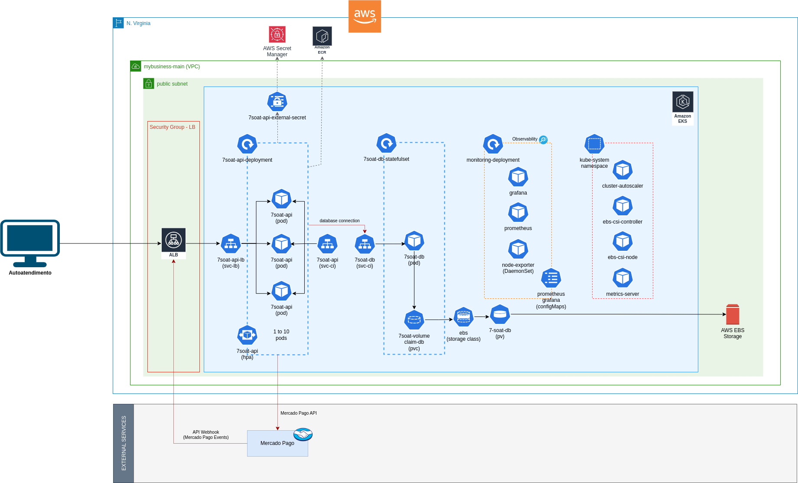

# Infrastructure

## Overview

<center></center>

<br>

- The infrastructure is deployed on AWS EKS.
- There is a VPC configured with 4 subnets: 2 public and 2 private.
- The Kubernetes cluster is in the 2 public subnets.
- **API Deployment**:
  - 1 service for an ALB load balancer to provide external access to the API.
  - HPA to horizontally scale the API up to 10 pods.
  - Secrets Manager integrated with AWS Secrets Manager to protect sensitive credentials.
  - 1 service with ClusterIP to expose the application's internal DNS, allowing Prometheus to perform service discovery for scraping.
- **Database StatefulSet**:
  - 1 service with ClusterIP for internal DNS for database connections with the application.
  - Use of a StatefulSet for deployment to prevent data loss if a pod fails to start and to guarantee a numbered identification of the pod.
  - Use of a PersistentVolumeClaim with a StorageClass for Amazon EBS to enable EBS for database data, allowing us to use EBS snapshots for database backups.
- **Monitoring**:
  - 1 Grafana pod instance.
  - 1 Prometheus pod instance.
  - Both use `emptyDir` for disk storage but can be evolved to use EBS for persistent data storage.
  - Node Exporter installed on each VM to monitor VM resources.
- **Kube-system**:
  - Some auxiliary services are installed in the kube-system namespace.
  - The Cluster Autoscaler monitors cluster compute resources and adjusts the AWS Auto Scaling Group to scale the cluster up and down according to resource usage.
  - EBS CSI implements the Kubernetes Container Storage Interface to enable the creation of storage classes for EBS resources.
  - Metrics Server allows HPA to monitor API pod resource usage and scale it up or down horizontally.
- **External Services**:
  - Mercado Pago: We use Mercado Pago to facilitate payments via Pix.


## Kubernetes Infra Setup Deployment

```
Requirements:
  - Kubectl must be installed in your operating system
  - The deployment scripts are designed for Unix environemts and were testes on Ubuntu 22.04 only.
  - Prior to using the scripts, you must get a shell with all environment variables set: ./infra/scripts/infra-shell.sh
```

1. Create IAM user for AWS CLI and Kubectl Usage with the following permissions:
```
1. AmazonEKSClusterPolicy
2. AmazonEKSServicePolicy
3. Custon Inline Policy. Suggested name: EKSCLIAccessPolicy

{
    "Version": "2012-10-17",
    "Statement": [
        {
            "Effect": "Allow",
            "Action": [
                "eks:CreateCluster",
                "eks:DeleteCluster",
                "eks:DescribeCluster",
                "eks:ListClusters",
                "eks:UpdateClusterConfig",
                "eks:UpdateClusterVersion",
                "eks:CreateNodegroup",
                "eks:UpdateNodegroupConfig",
                "eks:DeleteNodegroup",
                "eks:DescribeNodegroup",
                "eks:ListNodegroups",
                "iam:PassRole",
                "iam:GetRole",
                "ec2:DescribeKeyPairs"
            ],
            "Resource": "*"
        },
        {
            "Effect": "Allow",
            "Action": [
                "ecr:CreateRepository",
                "ecr:DescribeRepositories",
                "ecr:ListImages",
                "ecr:DescribeImages",
                "ecr:BatchCheckLayerAvailability",
                "ecr:GetDownloadUrlForLayer",
                "ecr:BatchGetImage",
                "ecr:PutImage",
                "ecr:InitiateLayerUpload",
                "ecr:UploadLayerPart",
                "ecr:CompleteLayerUpload",
                "ecr:GetAuthorizationToken"
            ],
            "Resource": "*"
        },
        {
            "Effect": "Allow",
            "Action": [
                "iam:GetOpenIDConnectProvider",
                "iam:CreateOpenIDConnectProvider",
                "iam:TagOpenIDConnectProvider",
                "iam:CreateRole",
                "eks:TagResource",
                "cloudformation:ListStacks",
                "cloudformation:CreateStack",
                "iam:*"
            ],
            "Resource": "*"
        }
    ]
}
```


2. Create ROLE for AWS EKS and AWS EKS Node Group:
```
1. AWS_EKS_ROLE

  1.1. AmazonEKSClusterPolicy
  1.2. Custom Inline Permission. Suggested name: AWSEKSExtraPermissions

{
    "Version": "2012-10-17",
    "Statement": [
        {
            "Effect": "Allow",
            "Action": [
                "eks:DescribeCluster",
                "eks:ListClusters",
                "eks:CreateNodegroup",
                "eks:UpdateNodegroupConfig",
                "eks:DeleteNodegroup",
                "eks:DescribeNodegroup",
                "eks:ListNodegroups",
                "eks:UpdateClusterConfig",
                "eks:UpdateClusterVersion"
            ],
            "Resource": "*"
        },
        {
            "Effect": "Allow",
            "Action": [
                "iam:PassRole"
            ],
            "Resource": "*"
        },
        {
            "Effect": "Allow",
            "Action": [
                "logs:CreateLogGroup",
                "logs:CreateLogStream",
                "logs:PutLogEvents",
                "logs:DescribeLogGroups",
                "logs:DescribeLogStreams"
            ],
            "Resource": "*"
        },
        {
            "Effect": "Allow",
            "Action": [
                "servicequotas:ListServiceQuotas",
                "servicequotas:GetServiceQuota",
                "servicequotas:RequestServiceQuotaIncrease"
            ],
            "Resource": "*"
        },
        {
            "Effect": "Allow",
            "Action": [
                "secretsmanager:GetSecretValue",
                "secretsmanager:ListSecrets"
            ],
            "Resource": "*"
        }
    ]
}

2. AWS_EKS_NODE_GROUP_ROLE

  2.1. AmazonEC2ContainerRegistryReadOnly
  2.2. AmazonEKS_CNI_Policy
  2.3. AmazonEKSWorkerNodePolicy
  2.4. Custom Inline Permission. Suggested name: EKSExtraPermissions

{
    "Version": "2012-10-17",
    "Statement": [
        {
            "Effect": "Allow",
            "Action": [
                "ec2:CreateVolume",
                "ec2:AttachVolume",
                "ec2:DeleteVolume",
                "ec2:DescribeVolumes",
                "ec2:DescribeVolumeStatus",
                "ec2:DescribeInstances",
                "ec2:DetachVolume",
                "ec2:CreateSnapshot",
                "ec2:DeleteSnapshot",
                "ec2:DescribeSnapshots",
                "ec2:ModifyVolume",
                "ec2:CreateTags"
            ],
            "Resource": "*"
        },
        {
            "Effect": "Allow",
            "Action": [
                "secretsmanager:GetSecretValue",
                "secretsmanager:ListSecrets"
            ],
            "Resource": "*"
        },
        {
            "Action": [
                "autoscaling:DescribeAutoScalingGroups",
                "autoscaling:DescribeAutoScalingInstances",
                "autoscaling:DescribeLaunchConfigurations",
                "autoscaling:DescribeTags",
                "autoscaling:SetDesiredCapacity",
                "autoscaling:TerminateInstanceInAutoScalingGroup",
                "ec2:DescribeLaunchTemplateVersions"
            ],
            "Resource": "*",
            "Effect": "Allow"
        }
    ]
}
```

3. Install necessary dependencies for AWS CLI
```
./infra/scripts/eks-cluster-deploy.sh setup-env
```

4. Configure AWS credentials for user created on step 1
```
./infra/scripts/eks-cluster-deploy.sh setup-aws-auth
```

5. Update kubectl config to reference EKS cluster
```
./infra/scripts/eks-cluster-deploy.sh update-kubeconfig
```

6. Create ECR repository
```
./infra/scripts/eks-cluster-deploy.sh create-ecr-repo
```

7. Create EKS kubernetes cluster
```
./infra/scripts/eks-cluster-deploy.sh create-eks-cluster
```

8. Create EKS Node Group
```
./infra/scripts/eks-cluster-deploy.sh create-node-group
```

9. Install metrics server on kube-system namespace to allow HPA
```
./infra/scripts/eks-cluster-deploy.sh install-metrics-server
```

10. Install external secrets operator
```
./infra/scripts/eks-cluster-deploy.sh install-external-secrets-operator
```

11. Install cluster autoscale
```
// Install cluster autoscaling
./infra/scripts/eks-cluster-deploy.sh install-cluster-autoscale

// Creates AWS IAM Policy for Auto Scaling Group Management
Suggested name: K8SASGPolicy
{
    "Version": "2012-10-17",
    "Statement": [
        {
            "Action": [
                "autoscaling:DescribeAutoScalingGroups",
                "autoscaling:DescribeAutoScalingInstances",
                "autoscaling:DescribeLaunchConfigurations",
                "autoscaling:DescribeTags",
                "autoscaling:SetDesiredCapacity",
                "autoscaling:TerminateInstanceInAutoScalingGroup",
                "ec2:DescribeLaunchTemplateVersions"
            ],
            "Resource": "*",
            "Effect": "Allow"
        }
    ]
}

// Creates a kubernetes service account with that policy
./infra/scripts/eks-cluster-deploy.sh cretae-service-account-autoscaler
```

12. Install AWS EBS CSI (Container Storage Interface)

```
// AWS driver to expose EBS features to EKS Kubernetes pods resources
helm repo add kubernetes-sigs https://kubernetes-sigs.github.io/aws-ebs-csi-driver/
helm repo update
helm install ebs-csi-driver kubernetes-sigs/aws-ebs-csi-driver
```

## Deploy Application on Kubernetes

```
Requirements:
  - Kubernetes Infra Setup Deployment must have been executed
  - Each "application" has its folder and the kubernetes resources are ordered. The deploy of each resource must
    follow the order
  - Bellow are the order in which each resource must be deployed
```

1. Deploy Database

```
kubectl apply -f infra/deployment/db/1-db-secrets-store.yaml
kubectl apply -f infra/deployment/db/2-db-secrets.yaml
kubectl apply -f infra/deployment/db/3-db-storage-class.yaml
kubectl apply -f infra/deployment/db/4-db-stateful-set.yaml
kubectl apply -f infra/deployment/db/5-db-service.yaml
```

2. Deploy API

**Note**: Make sure the api ECR image is the latest one in deployment file, otherwise, follow the instructions on *API ECR Image Deployment below*

```
kubectl apply -f infra/deployment/api/1-api-secrets-store.yaml
kubectl apply -f infra/deployment/api/2-api-secrets.yaml
kubectl apply -f infra/deployment/api/3-api-deployment.yaml
kubectl apply -f infra/deployment/api/4-api-hpa.yaml
kubectl apply -f infra/deployment/api/5-api-service-load-balancer.yaml
kubectl apply -f infra/deployment/api/6-api-service-cluster-ip.yaml
```

*API API ECR Image Deployment*

```
From the projects root directory, execute the following command:

./infra/scripts/eks-cluster-mng.sh update-api-image
```

1. Monitoring - Prometheus

```
kubectl apply -f infra/deployment/monitoring/prometheus/1-prometheus-node-exporter-daemonset.yaml
kubectl apply -f infra/deployment/monitoring/prometheus/2-prometheus-service-account.yaml
kubectl apply -f infra/deployment/monitoring/prometheus/3-prometheus-cluster-role.yaml
kubectl apply -f infra/deployment/monitoring/prometheus/4-prometheus-cluster-role-binding.yaml
kubectl apply -f infra/deployment/monitoring/prometheus/5-prometheus-config-map.yaml
kubectl apply -f infra/deployment/monitoring/prometheus/6-prometheus-dployment.yaml
kubectl apply -f infra/deployment/monitoring/prometheus/7-prometheus-service.yaml
```

4. Monitoring - Grafana

```
kubectl apply -f infra/deployment/monitoring/grafana/1-grafana-config-map.yaml
kubectl apply -f infra/deployment/monitoring/grafana/2-grafana-deployment.yaml
kubectl apply -f infra/deployment/monitoring/grafana/3-grafana-service.yaml
```

## Grafana Dashboards

 - Node Exporter Metrics: 1860
 - Node Express Metrics: 14565